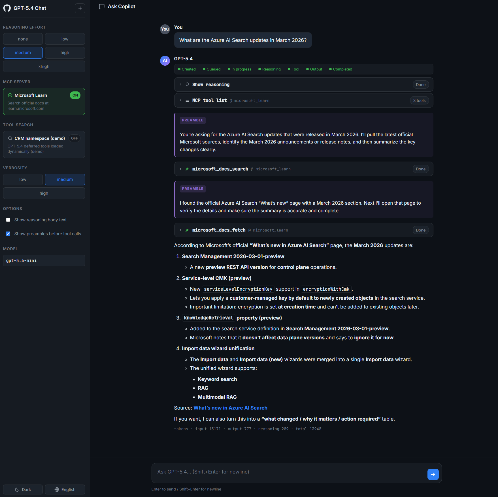

# GPT-5.4 Chat UI

[日本語](README.md) | **English**

A GitHub Copilot-style rich chat UI Flask app that streams the Azure OpenAI / OpenAI **Responses API** `gpt-5.4` family models. Supports Reasoning Summary, Tool Search, MCP, Mermaid, syntax highlighting, theme / language switching, and more.

> ⚠️ Note: `gpt-5.4` is a placeholder model name used in this sample repository. Specify the actual deployed model name via `AZURE_OPENAI_DEPLOYMENT`.

---

## Key Features

### Model controls
- **Reasoning effort**: switch between `none` / `low` / `medium` / `high` / `xhigh` from the sidebar
- **Verbosity**: switch output verbosity between `low` / `medium` / `high`
- **Tool Preambles**: inject the `<tool_preambles>` block from the official GPT-5 prompting guide as `instructions` to enable plan presentation and progress narration before tool calls (toggle on/off)
- **Reasoning body text display**: stream reasoning_text body via `include=["reasoning.encrypted_content"]` + `store=False` (toggle on/off)
- **Multi-turn CoT chaining**: automatic chaining via `previous_response_id`
- **Cancel**: stop in-flight Response via `responses.cancel` (managed per `session_id`)

### Tool integration
- **Microsoft Learn MCP** (`https://learn.microsoft.com/api/mcp`) invoked as a Responses API native MCP tool, with `mcp_list_tools` / `mcp_call` lifecycle visualized in the UI
- **Tool Search demo**: combines a CRM namespace with `defer_loading: true` tools (`list_open_orders` / `get_shipping_eta` / `search_customer`) and `{"type": "tool_search"}` to demonstrate dynamic deferred-tool resolution, plus mock execution of `function_call` → `function_call_output` chained up to 4 turns automatically

### UI / UX
- Two-pane layout: sidebar + chat pane
- **Reasoning Summary** streamed inside a collapsible card (Summary tab / Body text tab)
- **Answer text** rendered as Markdown (`marked` + `DOMPurify`)
- **Syntax highlighting** (highlight.js)
- **Mermaid diagrams** rendered from ` ```mermaid ` code fences
- **Citation URLs** (annotations) listed
- **Refusal / Incomplete** shown in dedicated banners
- **Usage** (input / output / reasoning / total tokens) shown at the end
- **Theme switching** (dark / light, with hljs theme and Mermaid theme synced)
- **Language switching** (Japanese / English, persisted in `localStorage`)
- **New chat** button to reset the conversation
- Suggestion buttons, textarea auto-resize, Enter to send / Shift+Enter for newline

### Backend
- Flask + Server-Sent Events forwarding `response.*` events directly to the frontend
- Customized `httpx.Client` with `read=600s` / suppressed keepalive to mitigate intermediate proxy disconnects during long reasoning
- Sends a heartbeat comment first
- Suppresses SSE buffering with `Cache-Control: no-transform` / `X-Accel-Buffering: no`



---

## Setup

```powershell
pip install -r requirements.txt
```

Place `.env` at the project root:

```
AZURE_OPENAI_API_KEY=...
AZURE_OPENAI_ENDPOINT=https://your-resource.openai.azure.com/
AZURE_OPENAI_DEPLOYMENT=gpt-5.4-mini
```

## Run

```powershell
python app.py
```

Open <http://127.0.0.1:5000> in your browser.

---

## API endpoints

| Method | Path           | Description                                                  |
| ------ | -------------- | ------------------------------------------------------------ |
| GET    | `/`            | Chat UI (`templates/index.html`)                             |
| POST   | `/api/chat`    | SSE streaming. See request body spec below                   |
| POST   | `/api/cancel`  | Cancel in-flight Response by `session_id`                    |

### `/api/chat` request example

```json
{
  "message": "List open orders for customer CUST-12345",
  "effort": "medium",
  "verbosity": "medium",
  "previous_response_id": null,
  "use_mcp": false,
  "use_tool_search": true,
  "show_reasoning_text": false,
  "use_preambles": true,
  "session_id": "sess_xxx"
}
```

### Main SSE events

`lifecycle` / `reasoning_delta` / `reasoning_done` / `reasoning_text_delta` / `text_delta` / `text_done` / `annotation` / `refusal_delta` / `refusal_done` / `incomplete` / `mcp_list_tools` / `mcp_call_start` / `mcp_args_done` / `mcp_call_done` / `mcp_call_failed` / `tool_search_call_start` / `tool_search_call_done` / `tool_search_output` / `function_call_start` / `function_args_delta` / `function_args_done` / `function_call_done` / `function_call_result` / `completed` / `error`

---

## File structure

- [app.py](app.py) – Flask + Responses API streaming, MCP / Tool Search / function_call loop
- [templates/index.html](templates/index.html) – Sidebar + chat pane UI
- [static/style.css](static/style.css) – Dark / light themes
- [static/app.js](static/app.js) – SSE client / Markdown / Mermaid / i18n / DOM updates
- [requirements.txt](requirements.txt) – `flask` / `openai` / `python-dotenv` / `httpx`
