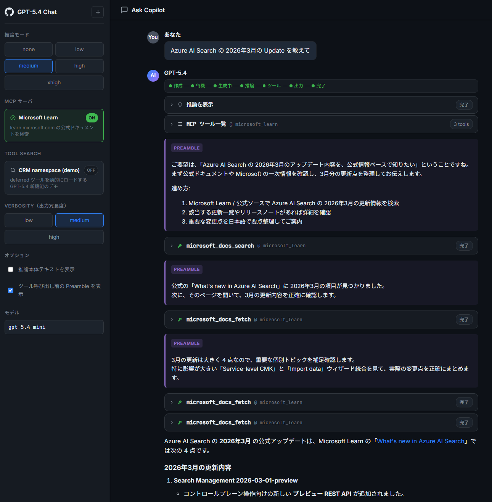

# GPT-5.4 Chat UI

**日本語** | [English](README.en.md)

GitHub Copilot 風のリッチなチャット UI で、Azure OpenAI / OpenAI **Responses API** の `gpt-5.4` 系モデルをストリーミング表示する Flask アプリ。Reasoning Summary、Tool Search、MCP、Mermaid、シンタックスハイライト、テーマ / 言語切替などをサポート。

> ⚠️ Note: `gpt-5.4` は本リポジトリ内のサンプル前提のモデル名です。実際にデプロイするモデル名を `AZURE_OPENAI_DEPLOYMENT` で指定してください。

---

## 主な機能

### モデル制御
- **Reasoning effort**: `none` / `low` / `medium` / `high` / `xhigh` をサイドバーから切替
- **Verbosity**: `low` / `medium` / `high` の出力冗長度を切替
- **Tool Preambles**: 公式 GPT-5 prompting guide の `<tool_preambles>` ブロックを `instructions` として注入し、ツール呼び出し前のプラン提示と進捗ナレーションを有効化（ON/OFF 可）
- **Reasoning 本体テキスト表示**: `include=["reasoning.encrypted_content"]` + `store=False` で reasoning_text 本文をストリーミング取得（ON/OFF 可）
- **マルチターン CoT 引き継ぎ**: `previous_response_id` を自動連鎖
- **キャンセル**: 進行中の Response を `responses.cancel` で停止（`session_id` で管理）

### Tool 連携
- **Microsoft Learn MCP** (`https://learn.microsoft.com/api/mcp`) を Responses API native MCP tool として呼び出し、`mcp_list_tools` / `mcp_call` のライフサイクルを UI に可視化
- **Tool Search デモ**: `defer_loading: true` を持つ CRM ネームスペース (`list_open_orders` / `get_shipping_eta` / `search_customer`) と `{"type": "tool_search"}` を組み合わせ、deferred ツールが動的に解決される様子と、`function_call` のモック実行 → `function_call_output` 連鎖を最大 4 ターンまで自動処理

### UI / UX
- サイドバー + チャットペインの 2 ペイン構成
- **Reasoning Summary** を折りたたみ可能なカードでストリーミング表示（Summary タブ / 本体テキストタブ切替）
- **回答テキスト** を Markdown でレンダリング（`marked` + `DOMPurify`）
- **シンタックスハイライト** (highlight.js)
- **Mermaid 図表** をコードフェンス ` ```mermaid ` で描画
- **引用 URL** (annotation) をリスト表示
- **Refusal / Incomplete** を専用バナーで表示
- **Usage** (input / output / reasoning / total tokens) を最後に表示
- **テーマ切替** (ダーク / ライト、hljs テーマと Mermaid テーマも連動)
- **言語切替** (日本語 / 英語、`localStorage` に永続化)
- **新しいチャット** ボタンで会話リセット
- 候補質問ボタン、textarea 自動リサイズ、Enter 送信 / Shift+Enter 改行

### バックエンド
- Flask + Server-Sent Events で `response.*` イベントをそのままフロントへ中継
- `httpx.Client` を `read=600s` / keepalive 抑制でカスタマイズし、長時間 reasoning 中の中間プロキシ切断を緩和
- ハートビートコメントを最初に送信
- `Cache-Control: no-transform` / `X-Accel-Buffering: no` で SSE バッファリングを抑止



---

## セットアップ

```powershell
pip install -r requirements.txt
```

ルートに `.env` を配置：

```
AZURE_OPENAI_API_KEY=...
AZURE_OPENAI_ENDPOINT=https://your-resource.openai.azure.com/
AZURE_OPENAI_DEPLOYMENT=gpt-5.4-mini
```

## 起動

```powershell
python app.py
```

ブラウザで <http://127.0.0.1:5000> を開く。

---

## API エンドポイント

| Method | Path           | 説明                                                |
| ------ | -------------- | --------------------------------------------------- |
| GET    | `/`            | チャット UI（`templates/index.html`）              |
| POST   | `/api/chat`    | SSE ストリーミング。リクエスト body 仕様は下記参照 |
| POST   | `/api/cancel`  | `session_id` で進行中 Response を `cancel`         |

### `/api/chat` リクエスト例

```json
{
  "message": "顧客 CUST-12345 の未処理注文を確認",
  "effort": "medium",
  "verbosity": "medium",
  "previous_response_id": null,
  "use_mcp": false,
  "use_tool_search": true,
  "show_reasoning_text": false,
  "use_preambles": true,
  "session_id": "sess_xxx"
}
```

### 主な SSE イベント

`lifecycle` / `reasoning_delta` / `reasoning_done` / `reasoning_text_delta` / `text_delta` / `text_done` / `annotation` / `refusal_delta` / `refusal_done` / `incomplete` / `mcp_list_tools` / `mcp_call_start` / `mcp_args_done` / `mcp_call_done` / `mcp_call_failed` / `tool_search_call_start` / `tool_search_call_done` / `tool_search_output` / `function_call_start` / `function_args_delta` / `function_args_done` / `function_call_done` / `function_call_result` / `completed` / `error`

---

## ファイル構成

- [app.py](app.py) – Flask + Responses API ストリーミング、MCP / Tool Search / function_call ループ
- [templates/index.html](templates/index.html) – サイドバー + チャットペインの UI
- [static/style.css](static/style.css) – ダーク / ライトテーマ
- [static/app.js](static/app.js) – SSE クライアント / Markdown / Mermaid / i18n / DOM 更新
- [requirements.txt](requirements.txt) – `flask` / `openai` / `python-dotenv` / `httpx`
